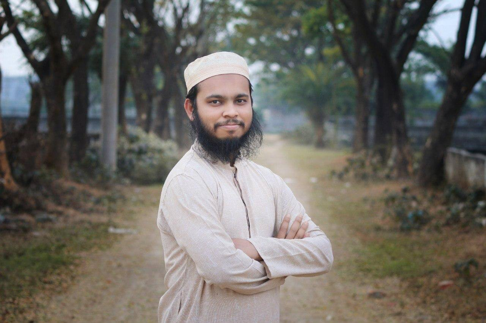

<a target="_blank" href="https://mdshahadathossainbd.github.io/Curriculum-Vitae/"></a>

# Md Shahadat Hossain

[](mailto:shahadat15-1464@diu.edu.bd?subject=From%20GitHub&cc=shahadatbd1464@gmail.com&body=Hi,%20there.%20Found%20you%20from%20GitHub.)
[](https://twitter.com/mdshahadat_bd)
[](https://www.linkedin.com/in/mdshahadathossain/)

[](https://medium.com/@mdshahadathossainBD)
[](https://www.kaggle.com/mdshahadathossain)
[](https://www.patreon.com/harunurrashid)

:wave: Hi there, My name is Harun-Ur-Rashid.😀 I'm 23 years old, I'm a self-taught Data Scientist.
I've profound knowledge in Machine Learning, Deep Learning, Natural language processing, AI Software Development. 
Currently, I completed Undergraduate in CSE from 🇧🇩. 
I'm interested in doing research on text and image related problems. 
I love to work with new technologies and playing with Data and AI.🤖

<p align="center">  </p>

## {...} My Stack

```json
{
   "languages": ["Python", "Java","C","JavaScript"],
   "backend": ["Django","Flask"],
   "frontend": ["html", "css"],
   "databases": ["mysql","MongoDB"],
   "ai framework":["Keras","PyTorch","Scikit-learn","PySpark"],
   "experimenting": ["Django", "Heroku"]
}
```
## :tada: Achievements

<ul>
  <li>
     <b>Top tech stories: </b> HackerNoon Online Publication,2020
   </li>
  <li>
     <b>1st Runner-Up: </b> NASA Space Apps Challenge organized by BASIS, 2019
   </li> 
   <li>
     <b>Awarded a bronze medal: </b> "Predicting Molecular Properties Competition Organized by Kaggle,2019
   </li>
   <li>
     <b>Top3: </b> Participated at Bracathon-2019
   </li>
   <li>
     <b>1st Runner up:</b> International Business Competition Organized by Hult Prize On Campus Round of Daffodil International University,2019
   </li>
</ul>


<p align="left">
  <a href="https://github.com/MdShahadatHossainbd"> 
</a>
</p>

[](https://github.com/harunurrashid97/100-Days-Of-ML-Code)


<p align="left">  </h1>
